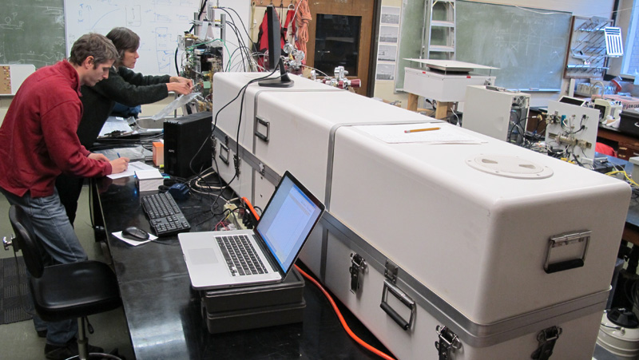

# UBC-TGA200-Bag-Sampling

This purpose of this code is to automatically analyze bag samples that have been processed through UBC's Campbell Scientific TGA 200 TDLAS system for stable isotope analysis of 13C and 18O in carbon dioxide. It is used to process TEDLAR bag samples of ambient air and from particular sources around ambient mixing ratios. The system is continually referenced against [UBC internal standard tanks](http://ibis.geog.ubc.ca/~achristn/tga200/calibration-tanks/) which themselves are calibrated against NOAA-ESRL and UoC-INSTAAR isotopic standards at [398.2 ppm](http://ibis.geog.ubc.ca/~achristn/tga200/calibration-tanks/NOAA-1/) and [467.6 ppm](http://ibis.geog.ubc.ca/~achristn/tga200/calibration-tanks/NOAA-2/).

[See below](#run) how to run the software. This section describes first the essential files needed to describe the system.

## Property List "tga200.plist"

This Property list is an ASCII file following the [.plist conventions](https://en.wikipedia.org/wiki/Property_list) needs to be edited by the user to fit the local or server paths of where data are stored. It contains file path settings to the following other files or directories:

### DefaultSetupFile  

Path to the [Setup File](#setupfile) in TOA5 ASCII format where the TANK ID connected to the five sites TGA 200 are described as they change over time. 

### DefaultTankCalibrationFile

Path to the [Tank Calibration File](#tankcalibfile) in TOA5 ASCII format that contains the total CO2, d13C, and d18O values for each TANK ID in UBC's Greenhouse Gas Laboratory. 

### DefaultBagSampleDirectory

The default directory in which the bag sampling [Sequence Description File](#sequencefile) and the output reports / graphs will be stored. The user can select a specific Sequence Description File when running the program. The path is simply the strating pointer where the dialog will ask you to select a file.

### DefaultLoggerDataDir

This is the default directory where your [Data Logger Files](#datalogger) from the TGA200 are stored. The user can select a particular file this when running. The path is simply the strating pointer where the dialog will ask you to select a file.

## Setup File

The Setup File contains information which sampling sites (inlets) of the TGA 200 system were connected to which calibration tanks. This configuration will change over time as tanks are emptied and new ones are connected.

### File format

The Setup File is a file that fulfills the TOA5 format as specified by Campbell Scientific. It is a regular ASCII comma separated file with 4 header lines.

### Header lines

The Setup File has 4 header rows, where rows 2-4 are column headers that indicate column headers (row 2), column units (row 3) and a generic "Smp" for all entries in row 4. Following on lines 5 - ... are then data entries.

### Data entries

On line 5 onwards each row corresponds to a time period during which the described setup of the TGA was operated. The first date contains year (column 1), month (column 2), day (column 3), hour (column 4) and minute (column 5) for the first date/time on which the current configuration of tanks was operated. The second date with year (column 6), month (column 7), day (column 8), hour (column 9) and minute (column 10) is the last date/time for which the current configuration of tanks was valid. "TANK_SITE1" (column 11), "TANK_SITE2" (column 12), "TANK_SITE3" (column 13), "TANK_SITE4" (column 14) and "TANK_SITE5" (column 15) descrive what was connected to to site 1 to site 5 of the TGA. In regular operation, site 1 is the EC inlet, site 2 is the storage inlet, and sites 3 to 5 are calibration tanks. This order, however can be different in different projects. Then "BRACKET_LOW" (column 16),"BRACKET_MED" (column 17),""BRACKET_HIGH" (column 18) are the calibration tank IDs as specified in the separate [Tank Calibration File](#tankcalibfile). The IDs must match those. For the purpose of the bag calibration, #only BRACKET_LOW and BRACKET_HIGH are used*. BRACKET_MED is usually the bag sample. However, as those files are also used for the regular operation of the TGA in EC mode, BRACKET_MED is included, but not used.

The last line must be an empty line (e.g. space)

### Example file

An example file is contained in this project under the name "TOA5_TGA200_Setup.txt". Here is the header and a few sample lines:

        "TOA5","CALIBRATION-TANKS-CONNECTED-TO-TGA200,"UBC","LAST-UPDATED-2013-04-25","N/A","N/A","N/A","N/A"
        "START_YEAR","START_MONTH","START_DAY","START_HOUR","START_MINUTE","END_YEAR","END_MONTH","END_DAY","END_HOUR","END_MINUTE","TANK_SITE1","TANK_SITE2","TANK_SITE3","TANK_SITE4","TANK_SITE5","BRACKET_LOW","BRACKET_MED",""BRACKET_HIGH"
        "year","month","day","hour","minute","year","month","day","hour","minute","text","text","text","text","text","site","site","site"
        "Smp","Smp","Smp","Smp","Smp","Smp","Smp","Smp","Smp","Smp","Smp","Smp","Smp","Smp","Smp","Smp","Smp","Smp"
        2014,09,12,14,40,2014,10,03,23,44,”Outdoor","Indoor","CO2-012","CO2-013","CO2-014",3,4,5
        2014,10,03,23,44,2014,10,06,20,00,"Outdoor","Outdoor2cm","CO2-012","CO2-014","CO2-013",3,5,4
        2014,10,06,20,00,2014,10,27,17,30,"Outdoor","Outdoor2cm","CO2-014","CO2-012","CO2-013",5,4,3
        ...

##  Tank Calibration File

### File format

The Setup File is a file that fulfills the TOA5 format as specified by Campbell Scientific. It is a regular ASCII comma separated file with 4 header lines.

### Header lines

The Setup File has 4 header rows, where rows 2-4 are column headers that indicate column headers (row 2), column units (row 3) and a generic "Smp" for all entries in row 4. Following on lines 5 - ... are then data entries.

### Data entries

From line 5 onwards we have a list of all calibration tanks. Each row is a calibration tank, that is identified by a unique ID (column 1), followed by total CO2 mixing ratio (column 2), d13C in CO2 (column 3), d18O in CO2 (column 4) and a note on the calibration of the tank / source (column 5). 

The last line must be an empty line (e.g. space)

### Example file

An example file is contained in this project under the name "TOA5_TGA200_Calibration_Gases.txt". Here is the header and to first entires for tanks with the IDs "CO2-001" and "CO2-002":

    "TOA5","CALIBRATION-TANKS-USED-WITH-TGA200,"UBC","LAST-UPDATED-2015-11-02","N/A","N/A","N/A","N/A"
    "TANK_ID","TOTAL_CO2","D13C","D18O","NOTES"
    "text","ppm","per mil","per mil","text"
    "Smp","Smp","Smp","Smp","Smp"
    "CO2-001",503.767,-15.024, -8.349,"TGA UBC (2014-01-14 / 2014-05-02)"
    "CO2-002",447.965,-11.724, -4.947,"TGA UBC (2013-04-24 / 2013-06-11 / 2013-07-10)"
    ...
     

Usually the latest sheet of tank analysis can be found under http://ibis.geog.ubc.ca/~achristn/tga200/calibration-tanks/

##  Sequence Description File

The Sequence Description File describes a sequence of bag samples analyzed on the same day or run. Each row is one bag attached to the TGA 200. For each new sequence the user needs to write this file first.

### File format

The Sequence Description File is a file that fulfills the TOA5 format as specified by Campbell Scientific. It is a regular ASCII comma separated file with 4 header lines.

### Header lines

The Sequence Description File has 4 header rows, where rows 2-4 are column headers that indicate column headers (row 2), column units (row 3) and a generic "Smp" for all entries in row 4. Following on lines 5 - ... are then data entries.

### Data entries

From line 5 onwards we have samples analyzed. Each row is one bag sample. "SAMPLE_ID" (Column 1) is the unique ID of this sample run, usually we use a format of YYYYMMDD-##, however any unique name is allowed that can be translated into file names,"BAG_ID" (Column 2) is the ID of a bag. A bag can be sampled several times, so the bag ID will not change but each time the sample ID will change, the date/time when the analysis started (back connected and switched to site 4 where bags are connected is described as "START_YEAR" (Column 3),"START_MONTH"  (Column 4),"START_DAY"  (Column 5),"START_HOUR"  (Column 6),"START_MINUTE"  (Column 7),"START_SECOND"  (Column 8). Under "NOTES"  (Column 9) any additional information on this sample can be stored. Within notes do not use commas. 

The last line must be an empty line (e.g. space)

### Example file

An example file is contained in this project under the name "TOA5_TGA200_Example_Bag_Sequence.txt". Here is the header and to first entires for bag samples with the IDs "CO2-001" and "CO2-002":

                "TOA5","Bag sampler run","UBC","2014/05/05","N/A","N/A","N/A","N/A"
                "SAMPLE_ID","BAG_ID","START_YEAR","START_MONTH","START_DAY","START_HOUR","START_MINUTE","START_SECOND","NOTES"
                "text","text","year","month","day","hour","minute","second","text"
                "Smp","Smp","Smp","Smp","Smp","Smp","Smp","Smp","Smp"
                "20140505-01","UBC-01",2014,05,05,20,12,00,"Background air from MacMillan parking lot 435 ppm Replicate 1/2"  
                "20140505-02","UBC-06",2014,05,05,20,15,00,"diluted sample from gasoline Ford Ranger 451 ppm Replicate 1/2"  
                "20140505-03","UBC-11",2014,05,05,20,18,00,"Diluted sample from gasoline vehicle mazda 3 408 ppm Replicate 1/2"

##  Data Logger Raw File

The high-frequency raw data are locally stored on the TGA PC under D:\met-data\tga200\ in the file CR3000_RawData.dat need to be copied after each run. This file contains the data measured by the TGA at 10 Hz resolution. The files can be quite large. They are stored in standard TOA5 file format.

## Running the code

1. Prepare and save a [Sequence Description File](#sequencefile) for the new sequence you have run.
2. Ensure the [Setup File](#setupfile) and the [Tank Calibration File](#tankcalibfile) are up to date
3. Ensure the local path to the [Setup File](#setupfile) and the [Tank Calibration File](#tankcalibfile) is entered properly in the [tga200.plist](#plist) file.
4. Ensure that [tga200.plist](#plist) file is the same directory as tga200_bag_samples.sav
5. Run the IDL virtual machine and select tga200_bag_samples.sav. 
6. The program will first asked to load a [Sequence Description File](#sequencefile) (Dialog asks for "Select your Sequence Description File"). Select the [Sequence Description File](#sequencefile) you have created for the run.
7. Next, the program will ask for the [Data Logger File](#datalogger) that contains the data from your run (Dialog asks for 'Select the Data Logger Raw File of your bag sampler run'). Select the corresponding "CR3000_RawData.dat" copied after the end of your bag sampling.
